  

I turn YAML, caffeine, and mildly concerning terminal sessions into infrastructure that *usually* stays up. Motto stays the same as `motto.txt`:

> **Building for 5 nines, until DNS happens**

- 🔭 Currently shipping: **Kubernetes clusters that behave (mostly)**
- 🌱 Currently debugging: **why the pod hates me specifically**
- 🧪 Lab notes: **I write about the scars so you don't have to collect them**
- 💬 Ask me about: **pipelines, platforms, and “it works on my cluster”**
- 📫 Ping me: **[sauravrana646@gmail.com](mailto:sauravrana646@gmail.com)**
- ⚡ Fun fact: **Five nines is the goal. DNS is the plot twist.**

 

## 🤝 Find me in the wild

  
  
  
  

 

## 💻 Weapons of mass automation

  
    
  

## 📊 Stats for nerds (the good kind)

  
  

   

  

   

  

## 🐍 Snake eats commits

  <picture>
    <source media="(prefers-color-scheme: dark)" srcset="https://raw.githubusercontent.com/sauravrana646/sauravrana646/output/github-contribution-grid-snake-dark.svg">
    <source media="(prefers-color-scheme: light)" srcset="https://raw.githubusercontent.com/sauravrana646/sauravrana646/output/github-contribution-grid-snake.svg">
    
  </picture>

